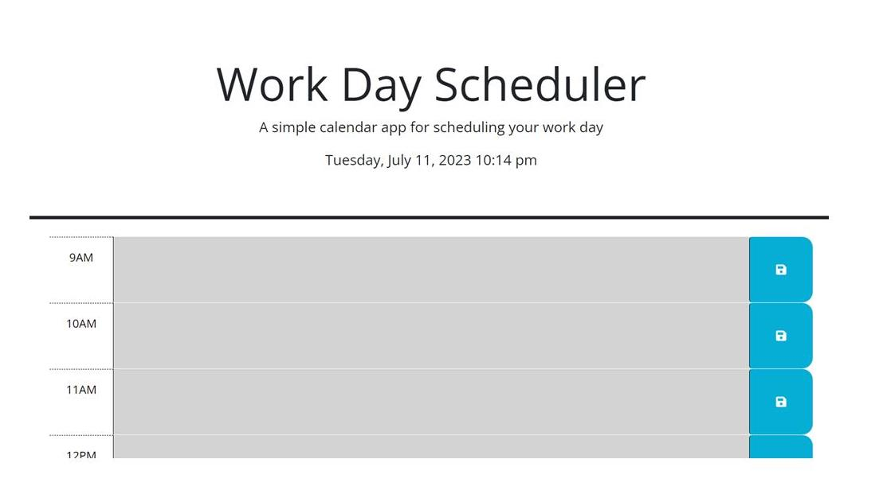

# WorkDayScheduler
Work Day Scheduler using third party API's for UT Coding Bootcamp Challenge 05

This program includes 6 files as follows:
index.html
readme.md
license
style.css
script.js
workdayschedule.jpg

The object of this project is to use as much JQuery code in order to accomplish this Work Day Scheduler.
Here are some requirements to the project:
A display of a typical work day form on the page.
The user is presented with the current date, day and time.
The user is presented with am open schedule from 9am to 5 pm.
When the user scrolls down, the user is presented with time blocks for every hour from 9 am to 5pm
Each time block is color coded as follows, any hour past the current hour will be in grey, 
a current hour will be in red, and any hour after the current hour will be in green.
The user can click on any hour and enter an event in the schedule.
The user can save this event in their scheduler.
The schedule will be saved in local storage.

Git Hub repository url:
https://github.com/agentpj/WorkDayScheduler

Git Hub deployment url:
https://agentpj.github.io/WorkDayScheduler/

